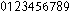
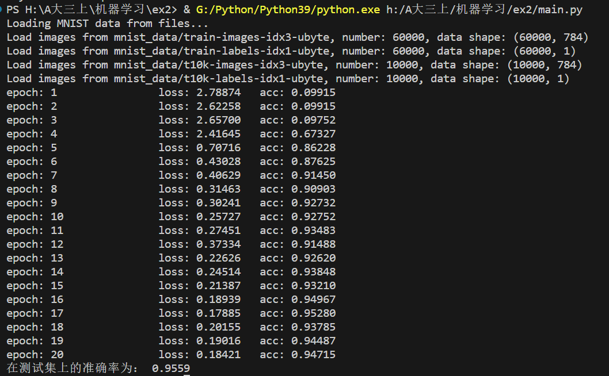
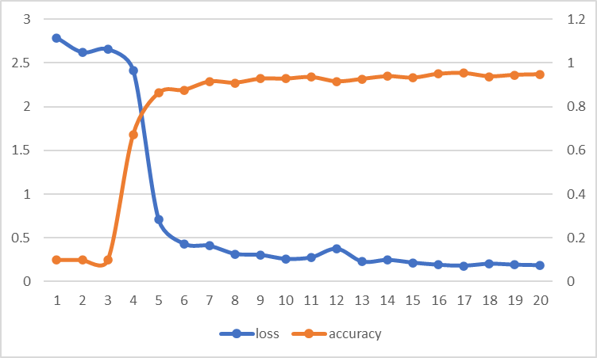

# LeNet5实验报告

## 网络结构

`LeNet5`网络共有七层：

1. 卷积层，使用6个大小为$5\times 5$的卷积核。
   + 输入：$1\times32\times32$（分别代表通道数、高度、宽度。下同）
   + 输出：$6\times28\times28$
2. 池化层，使用1个大小为$2\times 2$的卷积核，步长为2。
   + 输入：$6\times28\times28$
   + 输出：$6\times14\times14$
3. 卷积层，使用16个大小为$5\times 5$的卷积核。
   + 输入：$6\times\times14\times14$
   + 输出：$16\times10\times10$
4. 池化层，使用1个大小为$2\times 2$的卷积核， 步长为2。
   + 输入：$16\times10\times10$
   + 输出：$16\times5\times5$
5. 卷积层，使用120个大小为$5\times 5$的卷积核。
   + 输入：$16\times5\times5$
   + 输出：$120\times1\times1$
6. 全连接层。
   + 输入：$120$
   + 输出：$84$
7. 输出层，使用径向基函数。
   + 输入：$84$
   + 输出：$10$

除了输出层，每层之后都要加上`sigmoid`激活函数。

在此基础上，我们在最后一层之后加上了`softmax`和交叉熵损失函数，用于优化输出结果。

## 数据预处理

数据预处理部分我们使用与实验一相同的操作，读取数据集后将像素值小于40的赋值为0，大于或等于40的赋值为1，并将标签改为独热编码。

在输入网络前，需要对读入的图像做`padding`为$2$的处理，得到$32\times 32$的图像。

## 卷积层

### 基本思路

使用`Conv`类表示卷积层，卷积层的初始化需要提供如下参数：

1. `input_shape`：输入数据的维度，有三维，分别代表通道数、高度和宽度。
2. `kernel_size`：卷积核大小，在这里认为卷积核的长宽相等。
3. `kernel_num`：卷积核个数，决定输出的通道数

之后需要生成随机权重的卷积核和偏置项。

卷积核有四维，分别代表：

1. 卷积核个数
2. 通道数
3. 卷积核高度
4. 卷积核宽度

偏置项有一维，对应卷积核的个数。

我们将卷积核的权重和偏置项均设置为$[-1,1)$之间的随机数。

### 前向传播

卷积层的前向传播的实现思路为：先将矩阵按照卷积核的大小生成与输出对应的部分，之后再与卷积核进行对应项相乘再相加，得到输出的一项。

举个例子。

> 假设输入的维度为`(1,10,10)`（分别对应通道数、输入图像的高度、输入图像的宽度），每一个卷积核大小为`(1,5,5)`（分别对应通道数、卷积核高度、卷积核宽度），我们使用自定义的`split_by_stride`函数划分输入，得到的划分后的矩阵维度为`(1,6,6,5,5)`（分别对应通道数、输出图像高度、输出图像宽度、卷积核高度、卷积核宽度）。

`split_by_stride`方法实现如下：

```python
def split_by_stride(self, input, shape):
    strides = (*input.strides[:-2], input.strides[-2]*self.stride,
               input.strides[-1]*self.stride, *input.strides[-2:])
    return np.lib.stride_tricks.as_strided(input, shape=shape, strides=strides)
```

为了反向传播，需要记录卷积层的输入。在卷面积计算完成后，需要进行`sigmoid`激活函数。

在代码实现方面，我选择使用`numpy`提供的爱因斯坦求和约定进行计算。这个方法可以根据我们给定的规则计算，使代码中没有显式的循环，也比张量乘积使用更方便。

`python`代码实现如下：

```python
def forward(self, input):
    # 对矩阵进行分片
    self.input:np.ndarray = input
    self.input_shape = input.shape
    C, H, W = self.input_shape
    _, row, col = self.output_shape
    split_input = self.split_by_stride(input,(C, row, col, self.kernel_size, self.kernel_size))
    '''
    使用爱因斯坦求和约定计算卷积
    i -> 通道
    j -> 输出的行
    k -> 输出的列
    p -> 卷积核个数（输出通道数）
    l -> 卷积核的行
    m -> 卷积核的列
    '''
    self.output = np.einsum('ijklm,pilm->pjk', split_input, self.filters)\
        + self.bias.repeat(row * col).reshape(self.output_shape)
    # 计算sigmoid
    self.output = 1 / (1 + np.exp(-self.output))
    self.output_shape = self.output.shape
    return self.output
```

### 反向传播

首先进行`sigmoid`函数的反向传播。下面是用的输入均为传播之后的结果。

#### 对输入求梯度

为了更新前一层的权重，需要更新上一层对输入的梯度，求出对输入的梯度。计算步骤如下：

1. 对上一层输入的梯度矩阵做padding。
2. 将卷积核旋转180°。
3. 使用旋转后的卷积核对padding后的矩阵做卷积运算，得到对输入的梯度。

其中padding的计算方式如下：

> 假设图像的高度为$h$，宽度为$w$，卷积核大小为$s$，步长为1，则
> 1. 上方需要插入空白行数为$s-1$。
> 2. 下方需要插入的空白行数为$s-1+(h-s)%1$。
> 3. 左边需要插入的空白列数为$s-1$。
> 2. 右边需要插入的空白行数为$s-1+(w-s)%1$。

计算卷积的`python`代码如下：

```python
split_padded_input = self.split_by_stride(padded_input, (C, row, col, self.kernel_size, self.kernel_size))
input_grade = np.einsum('ijklm,iplm->pjk', split_padded_input, np.rot90(self.filters, 2, (2,3)))
```

#### 对权重求梯度

为了更新权重，需要计算对权重的梯度。计算步骤如下：

1. 以上一层的输入的梯度矩阵作为卷积核，按照该维度划分卷积层的输入矩阵。
2. 对卷积核和卷积层的输入矩阵做类似卷积的操作。

这里使用了类似卷积的操作，主要原因是输出的通道数和输入的通道数不一致，导致无法做常规的卷积。在更新权重的计算中需要同时保留输出通道数对应的维度和输入通道数对应的维度。

使用爱因斯坦求和约定使得这一个过程的表述变得简单。

计算这两个步骤的`python`代码如下：

```python
split_net_input = self.split_by_stride(self.input, (in_c, self.kernel_size, self.kernel_size, H, W))
weight_grade: np.ndarray = np.einsum('ijklm,plm->pijk', split_net_input, input)
```

#### 对偏置项求梯度

为了更新偏置项，需要对偏置项求梯度。

偏置项梯度的计算非常简单，只需要将不同通道的计算结果分别累加即可。

实现的`python`代码如下：

```python
'''
使用爱因斯坦求和约定计算卷积
c -> 通道
i -> 行
j -> 列
'''
bias_grade = np.einsum('cij->c', input)
```

## 池化层

### 基本思路

使用`Subsampling`类表示池化层。在初始化池化层时，需要提供以下参数：

1. `input_shape`：输入数据的维度，有三维，分别代表通道数、高度和宽度。
2. `kernel_size`：卷积核大小，在这里认为卷积核的长宽相等。
3. `stride`：卷积核的步长，在本实验中应与卷积核的边长相等。

之后需要生成随机权重的卷积核和偏置项。

卷积核有一维，对应通道数。

偏置项有一维，对应通道数。

我们将卷积核的权重和偏置项均设置为$[-1,1)$之间的随机数。


### 前向传播

在`LeNet5`模型中，池化层的思路为：将卷积核对应的数据求和后乘以权重，再加上偏置项。

和卷积层类似，池化层需要保留这次的输入用于反向传播，计算完成后也需要进行`sigmoid`激活函数。

`python`代码实现如下：

```python
def forward(self, input):
    # 对矩阵进行分片
    self.input = input
    self.input_shape = input.shape
    self.split_input = self.split_by_stride(input, (input.shape[0], self.row, self.col, self.kernel_size, self.kernel_size))
    # 使用爱因斯坦求和约定计算下采样
    C, row, col = self.output_shape
    self.output = np.einsum('ijklm,i->ijk', self.split_input, self.filters)\
        + self.bias.repeat(row * col).reshape(self.output_shape)
    self.output = 1 / (1 + np.exp(-self.output))
    self.output_shape = self.output.shape
    return self.output
```

### 反向传播

首先进行`sigmoid`函数的反向传播。下面是用的输入均为传播之后的结果。

#### 对输入的梯度

为了为上一层提供对输出的偏导，需要计算对输入的梯度。

根据这种方式的前向传播，可以推出对于构成一个输出项的输入来说，它们的梯度相等。所以我们可以计算完成每个输出对应的梯度后，将其重复若干次即可。

`python`代码实现如下：

```python
C, H, W = self.output_shape
in_c, in_h, in_w = self.input_shape
input_grade:np.ndarray = np.einsum('cij,c->cij', input, self.filters)
input_grade = input_grade.repeat(self.kernel_size, axis=1).repeat(self.kernel_size, axis=2)
```

#### 对权重的梯度

对权重的梯度的计算首先要将输入划分为与卷积核对应的部分，然后求和并与输出的对应项相乘，每各通道的结果相加即为对权重的梯度。

由于在前向传播的时候已经计算过输入的划分，所以在前向传播划分完成之后将结果保存下来，用于反向传播。

`python`代码实现如下：

```python
weight_grade = np.einsum('crlij,crl->c', self.split_input, input)
```

#### 对偏置项的梯度

对偏置项的梯度也是对每个通道求和即可。

```python
bias_grade = np.einsum('cij->c', input)
```

## 全连接层

### 设计思路

全连接层需要提供两个参数：

1. 输入大小
2. 输出大小

权重和偏置项均设置为$[-1,1)$的随机数。

### 前向传播

为了各层代码的一致性，我们在此也是用爱因斯坦求和约定计算。

`python`代码实现如下：

```python
self.output = np.einsum('i,ij->j',self.input,self.weight)\
            + self.bias
```

### 反向传播

首先进行`sigmoid`函数的反向传播。之后再进行计算。

反向传播与实验一中的过程类似，在此处给出使用爱因斯坦求和约定的计算方式：

```python
input_grade = np.einsum('j,ij->i', input, self.weight)
weight_grade = np.einsum('i,j->ij', self.input, input)
bias_grade = np.sum(input, axis=0)
```

## 输出层

### 设计思路

输出层需要提供两个参数：

1. 输入大小
2. 输出大小

为了尽可能贴近原模型，使用PS绘制了大小为3点的0-9这十个数字的图像：



在该大小下，恰好每个数字大小为12×7，与原模型中使用的大小一致。

我们定义`load_weight`方法，通过加载图像实现权重的确定，权重的维度为$10\times84$：

```python
def load_weight(self, fp):
    im = Image.open(fp)
    arr = np.asarray(im)
    # 由于上一步输出的范围为0-1，所以这里将白色设置为0，黑色设置为1
    f = np.frompyfunc(lambda x:0 if x == 1 else 1, 1, 1)
    numbers = f(arr).astype(np.int32)
    split_number = np.split(numbers, 10, axis=1)
    for i in range(len(split_number)):
        split_number[i] = split_number[i].reshape((-1,))
    self.weight = np.array(split_number)
```

### 前向传播

前向传播基本是按照径向基函数公式直接计算，但是有一点不同：由于按照RBF计算，越小越好，所以这里取相反数，使得结果越大越好。

计算公式为
$$
y_i=\sum_j(x_j-w_{ij})^2
$$
`python`代码实现如下：

```python
def forward(self, input):
    self.input = input
    self.output = np.zeros(self.output_size, dtype=np.float32)
    for i in range(self.output_size):
        for j in range(self.input_size):
            self.output[i] -= (input[j] - self.weight[i][j]) ** 2
    return self.output
```

### 反向传播

由于该层的参数由图像决定，所以不需要更新参数，只需要计算对输入的梯度即可。

```python
 def backprop(self, input: np.ndarray, alpha):
    input = input.reshape(self.output_size)
    input_grade = np.zeros(self.input_size, dtype=np.float32)
    for i in range(self.input_size):
        for j in range(self.output_size):
            input_grade[i] -= input[j] * 2 * (self.input[i] - self.weight[j][i])
    return input_grade
```

## LeNet5搭建

### 基本思路

我们使用`LeNet5`类表示网络，采取随机梯度下降的方法，每隔一部分数据输出一次损失率并计算在训练集上的准确率，所以在初始化网络时需要提供输出间隔的个数，设置为`batch_size`。

在该类中，使用一个列表`networks`存储所有的层，使用一种较为直观的方式添加所有层：

```python
networks = []
def __init__(self, batch_size) -> None:
    self.batch_size = batch_size
    self.add(Conv((1,32,32),5,6))\
        .add(Subsampling((6,28,28),2))\
        .add(Conv((6,14,14),5,16))\
        .add(Subsampling((16,10,10),2))\
        .add(Conv((16,5,5),5,120))\
        .add(Connect(120,84))\
        .add(Output(84,10))

def add(self, net):
    self.networks.append(net)
    return self
```

由于`sigmoid`激活函数的实现较为简单，所以在每层（除了`Output`层）各实现了激活层。

### 训练过程

在我们实验的过程中，选取迭代次数为20、初始学习率为0.5，每批从训练集中选取约6000个数据进行训练。

对每一个图像的训练步骤如下：

1. 进行网络的前向传播，得到最终得分
2. 经过softmax处理，得到处理后的得分
3. 使用交叉熵损失函数计算损失率
4. 计算损失函数对网络输出的梯度，输入网络进行反向传播

在每轮训练完后，需要完成：

1. 保存平均损失率
2. 计算在训练集上的准确率
3. 学习率衰减

在这里我们采取的学习率衰减策略为每进行一轮，学习率乘以$0.95$。

```python
def train(self, train_data: np.ndarray, y, iter=100, alpha=0.5):
    y_arg = np.argmax(y, axis=1)
    loss = []
    acc = []
    total_num = train_data.shape[0]
    for i in range(iter):
        curr_loss = 0
        num = 0
        for data, label in zip(train_data, y):
            if random.random() > self.batch_size / total_num:
                continue
            num += 1
            # 前向传播
            score = self.forward(data).T
            # 进行softmax处理
            score -= np.max(score)
            exp_score = np.exp(score)
            p = exp_score / np.sum(exp_score)
            func = np.frompyfunc(lambda x:x if x != 0 else 1e-20,1,1)
            # 计算交叉熵损失
            p = func(p).astype(np.float32).T
            f = -np.sum(label*np.log(p))
            curr_loss += f
            # 反向传播
            self.backprop(p-label , alpha)
        # 保存平均损失率
        loss.append(curr_loss / num)
        # 计算在训练集上的准确率
        preds = self.predict(train_data)
        curr_acc = 0
        for a, b in zip(preds, y_arg):
            if a == b:
                curr_acc += 1
        acc.append(curr_acc / total_num)
        print(f"epoch:{i+1}\tloss:{format(loss[-1], '.5f')}\tacc:{format(acc[-1], '.5f')}")
        # 学习率衰减
        alpha *= 0.95
    return loss, acc
```

## 模型的保存与加载

为了方便后续使用和复现，我们增加模型的保存和加载的实现。

### 保存

我们在`LeNet5`类里增加方法`dump`，将各层的卷积核或权重、偏置项保存为一个列表，使用`pickle`保存。

```python
def dump(self, fp):
    # 将所有层训练得到的参数导出
    params = []
    # 1. 前五层导出filters和bias
    for i in range(5):
        params.append([self.networks[i].filters,self.networks[i].bias])
    # 2. 第六层导出weight和bias
    params.append([self.networks[5].weight, self.networks[5].bias])
    with open(fp, "wb+") as f:
        pickle.dump(params, f)
```

### 加载

我们在`LeNet5`类里增加方法`load`，将各层的卷积核或权重、偏置项保存为一个列表，使用`pickle`加载。

```python
def load(self, fp):
    with open(fp, "rb") as f:
        params = pickle.load(f)
    for i in range(5):
        self.networks[i].filters = params[i][0]
        self.networks[i].bias = params[i][1]
    
    self.networks[5].weight = params[5][0]
    self.networks[5].bias = params[5][1]
```

## 实验验证

### 实验环境

本次的实验环境为：

| 配置项 | 配置 |
| ---- | ---- |
| 系统 | Windows 11, 版本号22631.3007 |
| Python版本 | 3.9.13 |
| CPU | Intel i9-13900HX |
| IDE | VS Code 1.85.1 |

### 实验结果

测试多次，取在测试集上准确率最高的一次，实验结果如下：



最终在测试集上的准确率为95.59%。

### 实验结果分析



在刚开始，由于训练数据不够多，所以损失率很高，准确率也很低。但是当训练了4轮之后（相当于训练了24000个样本），损失率有明显降低，准确率也有较高的提升。

当迭代7次之后，可以发现损失率和准确率会在一个数值附近波动。一开始会因为学习率较大，所以波动幅度较大。后续数值波动幅度较小，趋于稳定。
